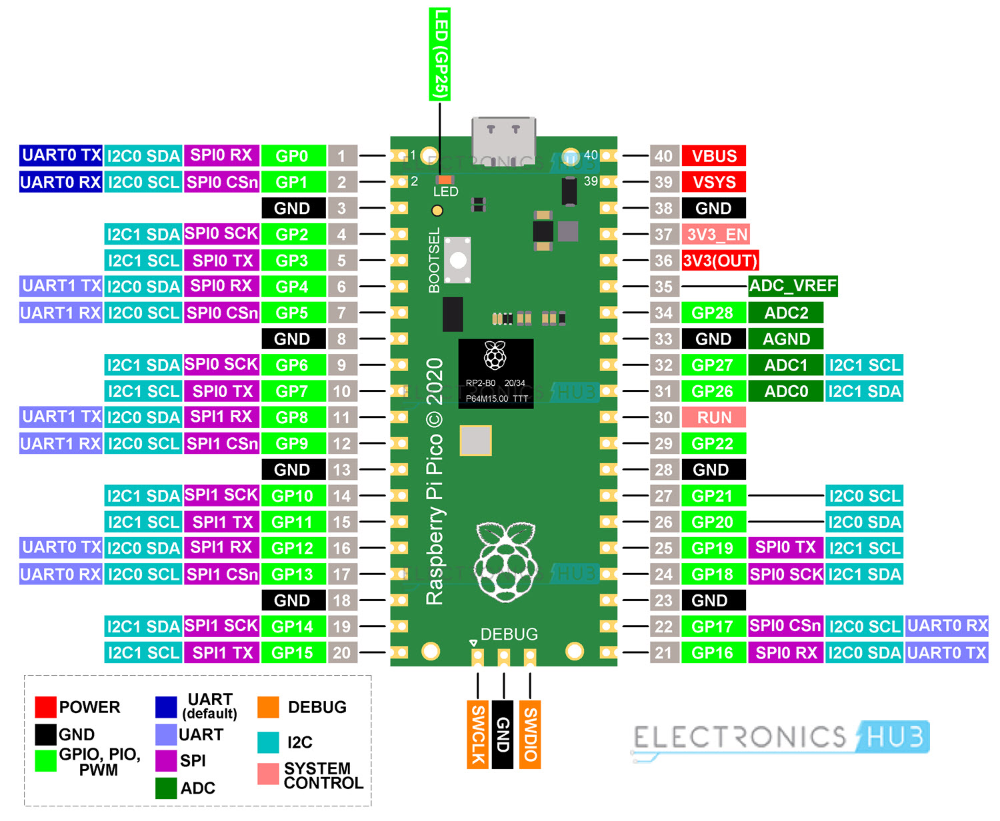
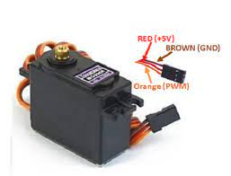
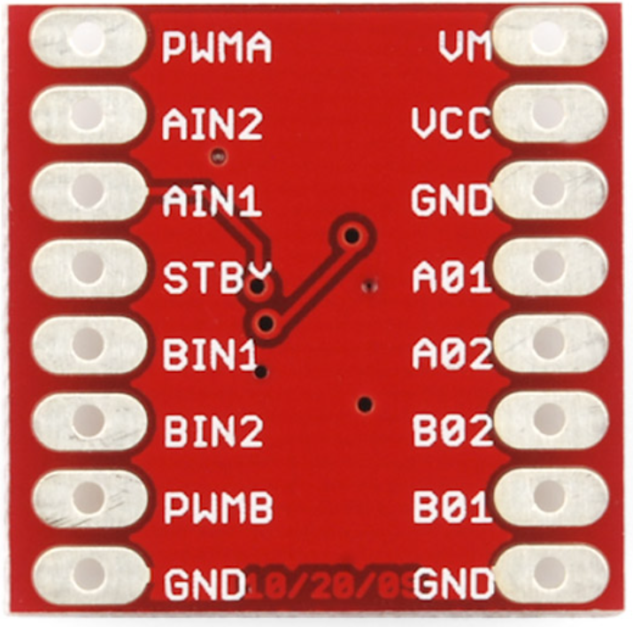
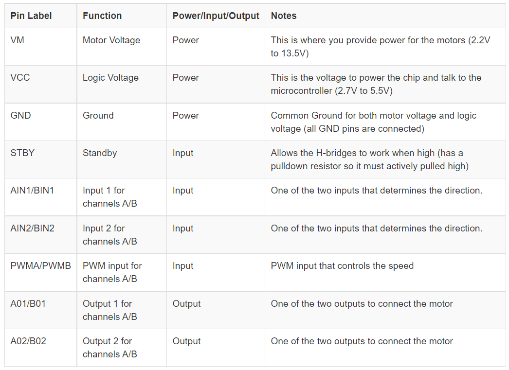

# mg996rvp
MicroPython Code for Steering Bar Car

## Reboot
Ctrl + D

## Comment out
 Ctrl + K then press Ctrl + C

## uncomment Out code
    Ctrl + K then press Ctrl + U

## Pins to be used in PCB
Servo: 1, HCsr04: 2, 2 buttons : 2, tb6612 : 4
28 gpio pins available on Pico
9 Needed for Robot
Suggest GP7-GP15 be used for PCB
* GP7: SteeringServo
* GP8: HCsr04:ECHO
* GP9: HCsr04:TRIGGER
* GP10: BUTON1
* GP11: BUTTON2
* GP12: Speed Control
* GP13: AIN2
* GP14: AIN1
* GP15: STBY

## mobile network
name: MB-brikeda

# HC-SR04
Range: 400 cm
The HC-SR04 sensor works best between 2cm – 400 cm (1" - 13ft) within a 30 degree cone, and is accurate to the nearest 0.3cm.
    
# Raspberry Pi Pico Pin Layout

# Servo Wiring

## TB6612

